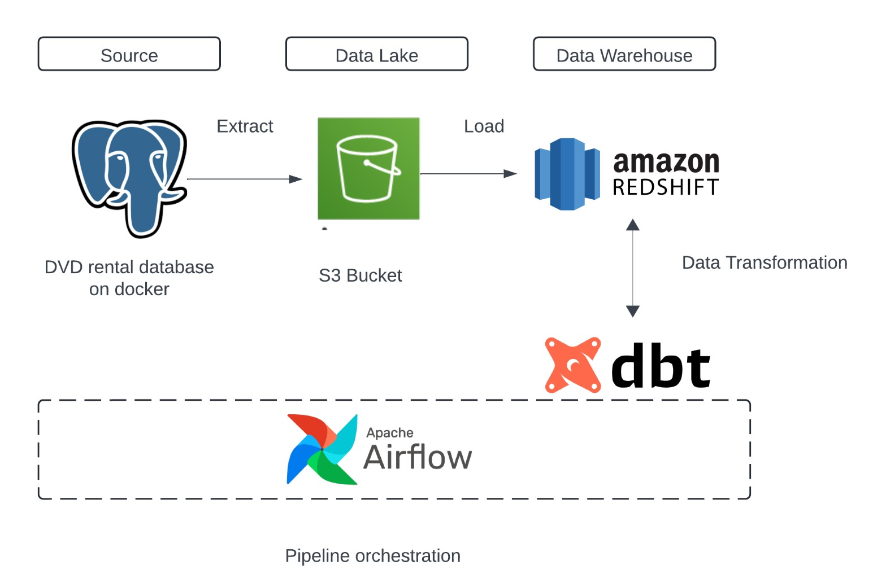

DVD Rental ELT Data Pipeline
========

This repository contains a simple ELT(Extract Load and Transform) data pipeline that extracts data from a dvd-rental postgreSQL database running in a Docker container, uploads the data to an S3 bucket, and loads it into Amazon Redshift. Cosmos-dbt is then used to transform the data. All these is orchestrated using astronomer airflow


## Data Architecture


## Requirements
 - Docker and docker compose
 - Python 3.x
 - AWS account with S3 and Redshift access
 - Astro Airflow CLI

## Source Setup

Data source: https://www.postgresqltutorial.com/postgresql-getting-started/postgresql-sample-database/

- Download dvdrental.tar file from the source above
- Navigate to the source folder on your terminal. Create postgres and pg4Admin docker container by running the following command ```docker-compose up -d```
- Create ```dvd_rental``` database on pg4Admin. You can access pg4Admin by going to http://localhost:8889 on your browser. The username is ```postgres@postgres.com``` while the password is ```postgres```
- To load the data run the following command on your terminal: ```
docker exec -it <postgres container_id> pg_restore -d <dvd_rental_database_name> <path/dvdrental.tar> -c -U postgres ```


## Data Lake Setup
- Create an account on AWS
- Create s3 bucket. The name must be globally unique. Update the ```MY_S3_BUCKET``` variable  in ```dag_template.jinja2``` file and in the extract and load dags
- Create IAM user with s3 access
- Create and download access key

## Data Warehouse Setup

- Create IAM Role for Redshift and attach AmazonS3ReadOnlyAccess permission
- Create redshift cluster, manually add admin password and attached the role created. Take note of the username and password when creating the cluster
- Allow public connections to Amazon Redshift. Edit Network and security settings in the cluster properties tab
- Grant your IP access to the redshift cluster in the cluster VPC security group settings by editing the inbound rule 
- Open redshift query editor. Connect to the cluster using username and password. Create a database named ```dvd_rental``` and two Schemas. One schema for the ```raw_data``` and the other for the ```transformed_data```


Note: Please delete the redshift cluster immediately your are done with the project (if you don't need it afterwards) as it expensive to run the clusters. Also, the cluster network configuration mentioned is only used for learning purpose. Do not use in prod environment.


## Dag Generation
- The extract and load dags where generated dynamically from a jinja template. To to create these dags, create a .yaml file in ```include/inputs/``` directory using the table name as file name e.g ```payment.yaml```. The file must contain the following details


    ```
    dag_version: '01'
    table_name: 'payment'
    load_method: 'incremental'
    start_date: '2007-02-14'
    end_date: '2007-02-20'
    date_column: 'payment_date'
    redshift_load_method: 'APPEND'
    ```

    After creating ```.yaml``` files, navigate to the ```scripts/``` directory then run the dag generator python script locally ```python3 dag_generator.py```. Make sure you have jinja2, pathlib and yaml is installed locally

- Add redshift creat table scripts in  ```include/sql/create_tables``` using the table name as the file name


## DBT Setup
Cosmos is used to run the dbt models. With each step of a model shown as an Airflow task, Cosmos extends your DBT project into a Task Group or a complete DAG, allowing users to see exactly what they're doing. This enables tracking of individual tasks, debugging, and re-running in the event that a dbt model fails. The dbt dag is named ```dbt_dap.py``` while the dbt project files is at ```include/dbt_project```


## Airflow Setup

- Install Astro Cli - https://www.astronomer.io/docs/astro/cli/install-cli
- To start airflow locally, navigate to dvd-rental-pipeline directory on your terminal then run the following command:
```astro dev start```
- The command will start your project with the Airflow Webserver exposed at port 8080 and Postgres exposed at port 5432. If you already have either of those ports allocated, you can either [stop your existing Docker containers or change the port](https://docs.astronomer.io/astro/test-and-troubleshoot-locally#ports-are-not-available)

- Access the Airflow UI for your local Airflow project. To do so, go to http://localhost:8080/ and log in with 'admin' for both your Username and Password.


- Create connections for postgres, s3 and redshift on airflow UI. 
    - Postgres connection details; name:```postgres_conn```, host: ```host.docker.internal```, username:```postgres```, password:```postgres```, database:```dvd_rental```
    - S3 connection details: name:```aws_s3_conn```. Get the access_key_id and secret access key from the file that was downloaded when creating the IAM user  
    - Redshift connection details: name:```redshift_conn``` Get the host address from the cluster details on AWS. e.g ```redshift-cluster-1.********.eu-north-1.redshift.amazonaws.com``` Add the username and password used when creating the cluster. Database name is ```dvd_rental``` while the port is ```5439``` 


    